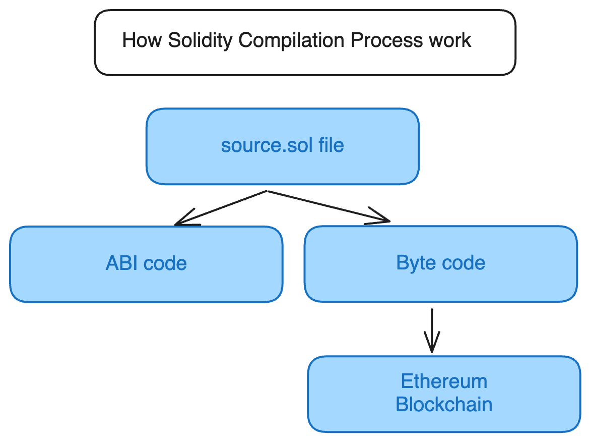

## Solidity Compilation Process 


## Contributing

Contributions are welcome! Please fork the repository and submit a pull request with your changes.

## License

This project is licensed under the [MIT License](LICENSE).
```

Feel free to customize this README.md file further based on your specific project details, additional features, or specific deployment instructions. It serves as a comprehensive guide for developers and users to understand, install, and contribute to EncryptID.